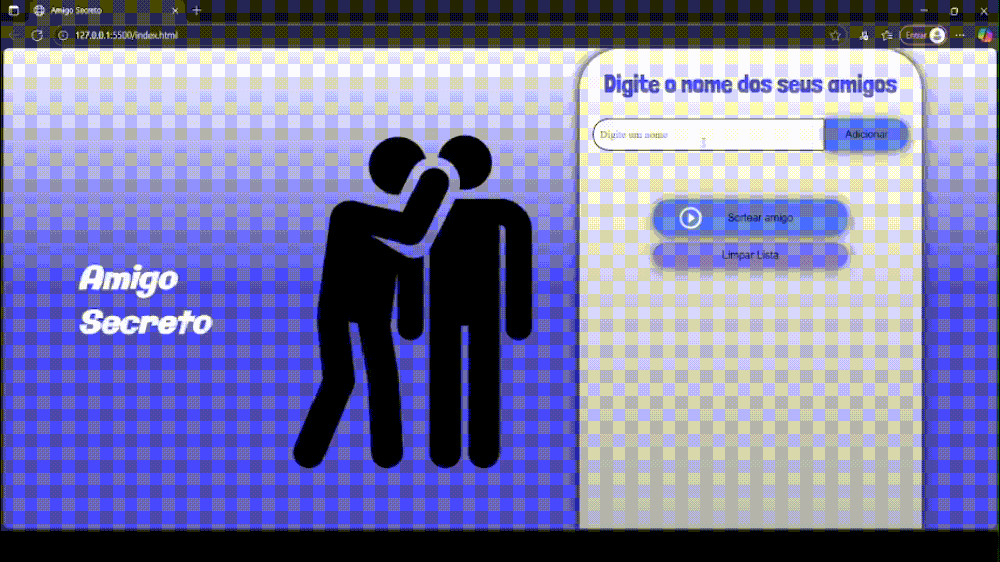

# Amigo Secreto 🎁 – Aplicação Web Simples para Sorteios

## Descrição

Este projeto é uma aplicação web simples para organizar sorteios de Amigo Secreto. Os usuários podem adicionar nomes de participantes, sortear os amigos secretos e limpar a lista.

## Funcionalidades

*   **Adicionar participantes:** Insira o nome dos participantes na lista.
*   **Sortear:** Realiza o sorteio aleatório dos amigos secretos.
*   **Ocultar resultado:** Permite ocultar o nome do amigo secreto sorteado.
*   **Limpar lista:** Remove todos os participantes da lista.


## Pré-requisitos

Não é necessário instalar nada. Basta abrir o `index.html` em qualquer navegador moderno (Chrome, Firefox, Edge, etc.).


## Como usar

1.  Abra o arquivo `index.html` em seu navegador.
2.  Digite o nome de um participante no campo de texto e clique em "Adicionar".
3.  Repita o processo para adicionar todos os participantes.
4.  Clique em "Sortear amigo" para realizar o sorteio. O resultado será exibido na tela.
5.  Clique em "Ocultar Resultado" para esconder o resultado do sorteio.
6.  Clique em "Limpar Lista" para remover todos os participantes da lista.


## Demonstração

<p align="center">
  
</p>


## Tecnologias utilizadas

*   HTML
*   CSS
*   JavaScript

## Estrutura de arquivos
```
amigo-secreto/
├── index.html # Estrutura HTML da página
├── style.css # Estilos CSS
├── app.js # Lógica JavaScript
└── assets/ # Pasta com imagens
    ├── amigo-secreto1.png
    └── play_circle_outline.png
```

## Implantação

Para implantar este projeto, basta hospedar os arquivos HTML, CSS, JavaScript e a pasta `assets` em um servidor web.

## Personalização

Você pode personalizar a aparência do projeto editando o arquivo `style.css`. Para adicionar novas funcionalidades, edite o arquivo `app.js`.

## Contribuição

Contribuições são bem-vindas! Sinta-se à vontade para abrir issues e pull requests.
